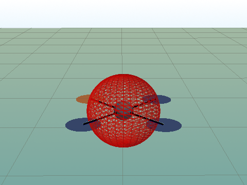
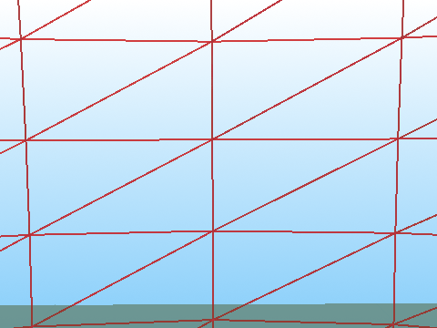
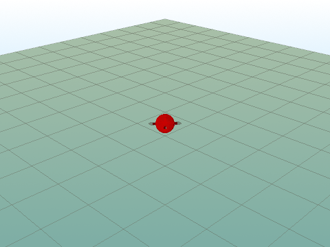
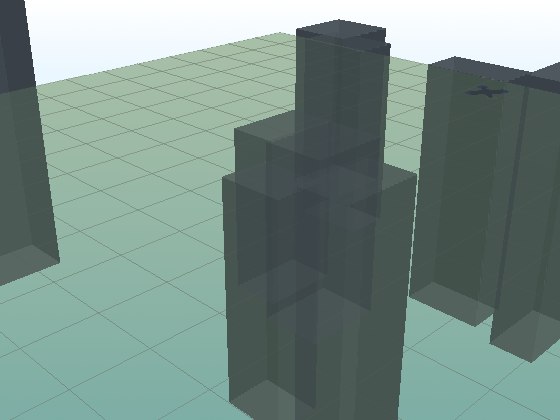

# rotorenv

A lightweight, [Gymnasium](https://gymnasium.farama.org/)-compatible reinforcement
learning environment for training autonomous drone (quadrotor) agents. Pure
Python, physics-first, and designed to be extended incrementally.

## A trained PPO policy hovering (6-DOF)

Rendered with the optional PyVista engine. The drone (front rotor in orange)
holds the translucent target, gold line is its flight trail.

| Chase (3rd-person) | Onboard (POV) | Orbit |
|:--:|:--:|:--:|
|  |  |  |

> These show a 50k-step smoke-test policy: it holds the hover briefly, then
> drifts — proof the env is learnable, not a finished pilot. Longer training
> tightens it. Reproduce with `examples/train_ppo.py` + `examples/render_flight.py`.

## Procedural obstacle-field navigation (`Navigation-v0`)

"MiniGrid in 3D": each episode spawns a random field of pillar obstacles; the
drone must fly start → goal without colliding. Obstacle count scales with
curriculum difficulty.



> Flown here by a *scripted* controller just to show the procedural layout — no
> trained navigation policy yet (perception/training is the next phase).

## Status

**Phase 1 (complete)**
- Point-mass physics (no drag, no rotor lag, no inertia matrix)
- `Hover-v0`: hold position at `(0, 0, 1.0)`
- No ML framework dependency — environment only

**Phase 2 (complete)**
- Full 6-DOF rigid-body physics: diagonal inertia tensor, body torques,
  quaternion attitude integration, linear + angular drag
- `Hover6DOF-v0`: same hover task on the 6-DOF backend
- Upgraded 3D renderer: a quadrotor cross that **tilts with true attitude**,
  body-up axis, and a fading trajectory trail

**Phase 3 (complete) — mature-env architecture**
- Enum-configurable spaces (`ObservationType`, `ActionType`), following the
  `gym-pybullet-drones` pattern — obs/action shapes are configuration, not
  hardcoded constants
- Finite, physically-bounded observation space (passes
  `gymnasium.utils.env_checker.check_env`)
- Example wrappers (`NormalizeObservation`, `RewardScale`) + vectorized-env
  support via `gymnasium.make_vec`

**Phase 4 (complete) — tasks + curriculum learning**
- New tasks over the same base: `WaypointEnv` (reach a sampled target) and
  `TrajectoryEnv` (track a moving Lissajous-curve target) — the
  Hover→Waypoint→Trajectory difficulty ladder common to drone-RL projects
- Difficulty is a first-class `[0, 1]` knob set via `reset(options=...)`; tasks
  scale their target spread by it
- `CurriculumWrapper` with two selectable schedules: **success-based**
  (performance-staged, QuadCtrl-style) and **step-annealed** (quad-swarm-rl's
  `anneal_*_steps` pattern)
- Eight registered variants across three task families

## Install

Python 3.10+ is required. Homebrew Python is *externally managed* (PEP 668), so
use a virtual environment:

```bash
python3 -m venv .venv
source .venv/bin/activate
pip install -e ".[dev]"
```

## Quick start

```python
import rotorenv

env = rotorenv.make("Hover-v0")          # also: gymnasium.make("Hover-v0")
obs, info = env.reset(seed=0)
for _ in range(100):
    action = env.action_space.sample()    # [thrust, roll, pitch, yaw] in [-1, 1]
    obs, reward, terminated, truncated, info = env.step(action)
    if terminated or truncated:
        break
env.close()
```

Run the random-agent sanity check:

```bash
python examples/random_agent.py
```

Watch a 6-DOF episode in the live 3D window (tilting quad + trajectory trail):

```bash
python examples/render_6dof.py
```

Train a PPO policy (requires the optional `rl` extra) and watch it fly:

```bash
pip install -e ".[rl]"                                   # stable-baselines3
python examples/train_ppo.py --env HoverEasy-v0 --steps 50000
python examples/train_ppo.py --env HoverEasy-v0 --replay-only   # live 3D replay
```

This writes a learning curve to `runs/<env>/learning_curve.png` and prints an
eval summary. `HoverEasy-v0` spawns the drone airborne (pure attitude-stabilised
hover) — far more learnable from scratch than the ground-spawn tasks, which
require learning takeoff.

Render a trained policy's flight to a cinematic 3D video (requires the `render`
extra; uses PyVista with a real drone model and moving cameras):

```bash
pip install -e ".[rl,render]"
python examples/render_flight.py --env HoverEasy-v0 --camera chase --out flight.mp4
python examples/render_flight.py --env HoverEasy-v0 --camera pov    # onboard view
python examples/render_flight.py --env HoverEasy-v0 --camera orbit  # static wide shot
```

Two renderers ship: `MatplotlibRenderer` (zero-dep, fixed-camera live window,
the default `render_mode="human"`) and `PyVistaRenderer` (optional, chase/POV/
orbit cameras, saved MP4/GIF).

Run the tests:

```bash
pytest
```

## Architecture

`rotorenv` keeps physics, reward, and observation as independent, swappable
concerns:

```
rotorenv/
├── core/        DroneState, DroneAction, reward terms, rotation utils
├── physics/     DronePhysics protocol + PointMassPhysics + SixDOFPhysics
├── envs/        DroneEnv base (Gym plumbing) + HoverEnv task
└── rendering/   Matplotlib 3D renderer (lazy-imported)
```

- **Physics is a `Protocol`.** `SixDOFPhysics` (Phase 2) was added purely by
  matching `step(state, action) -> DroneState`; the environment imports no
  concrete physics class. Select a backend via `physics_model="point_mass"`
  (default) or `"six_dof"`, or pass your own instance.
- **Reward is data.** A task's shaping is a list of `RewardTerm` objects summed
  by `CompositeReward`, not a hard-coded function.
- **Tasks subclass `DroneEnv`.** A task supplies the initial state, target,
  reward, and termination rule — never the step loop.

### Registered environments

| ID | Task | Physics | Obs | Action |
|----|------|---------|-----|--------|
| `Hover-v0` | hold fixed point | point mass | full (16,) | attitude (4,) |
| `Hover6DOF-v0` | hold fixed point | 6-DOF | full (16,) | attitude (4,) |
| `HoverMinimal-v0` | hold fixed point | point mass | minimal (13,) | attitude (4,) |
| `HoverThrustOnly-v0` | hold fixed point | point mass | full (16,) | thrust (1,) |
| `Waypoint-v0` | reach sampled target | point mass | full (16,) | attitude (4,) |
| `Waypoint6DOF-v0` | reach sampled target | 6-DOF | full (16,) | attitude (4,) |
| `Trajectory-v0` | track moving target | point mass | full (16,) | attitude (4,) |
| `Trajectory6DOF-v0` | track moving target | 6-DOF | full (16,) | attitude (4,) |

Each is one task class with different registry `kwargs`. Build configurations
directly, wrap, or apply a curriculum:

```python
import rotorenv
from rotorenv.envs import NormalizeObservation, CurriculumWrapper

env = rotorenv.make("Hover6DOF-v0")
env = NormalizeObservation(env)          # rescale obs into [-1, 1]

# Configure spaces explicitly:
from rotorenv.envs.hover_env import HoverEnv
env = HoverEnv(observation_type="minimal", action_type="thrust_only")

# Curriculum learning (auto-anneals task difficulty):
env = CurriculumWrapper(rotorenv.make("Waypoint-v0"), mode="success")
# or step-annealed: mode="step", anneal_steps=200_000
```

### Domain model

| Field | Shape | Meaning |
|-------|-------|---------|
| `position` | (3,) | x, y, z [m] |
| `velocity` | (3,) | m/s |
| `orientation` | (3,) | roll, pitch, yaw [rad] |
| `angular_velocity` | (3,) | rad/s |
| `time` | scalar | elapsed [s] |

**Observation** (selected by `ObservationType`):
- `minimal` (13,): `position(3) + velocity(3) + orientation(3) + distance_to_target(3) + time(1)`
- `full` (16,, **default**): the above + `angular_velocity(3)`

The observation space has finite, physically-motivated bounds (so it passes
`check_env` and works with normalization wrappers).

**Action** (selected by `ActionType`):
- `attitude` (4,, **default**): `[thrust, roll, pitch, yaw]` in `[-1, 1]`
- `thrust_only` (1,): `[thrust]`; roll/pitch/yaw held at zero

Thrust is rescaled `[-1, 1] -> [0, 1]` so a neutral `0` command is a 50%
throttle hover.

## License

MIT
